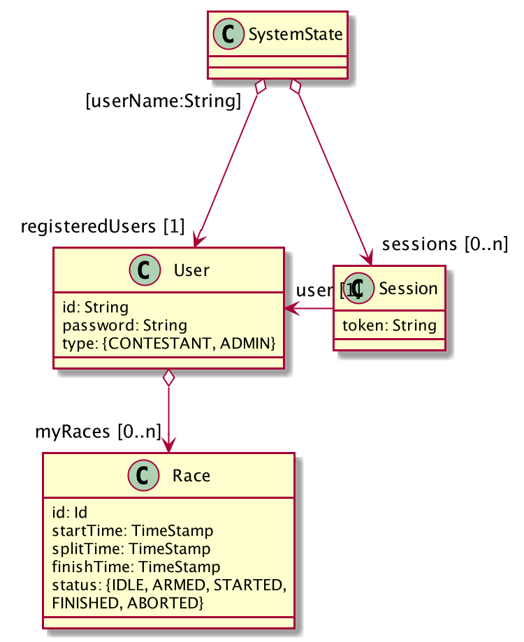
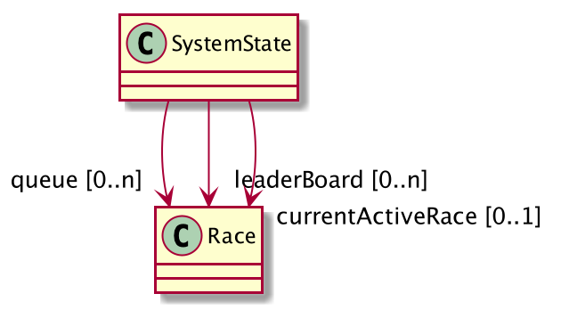

# System state transformations
The API of this model is declared in the [GraphQL schema file](../cag-racing-manager-api.graphql).

## Domain model 
### Users and sessions

### Racing

The system contains a number of `User`:s and a user is qualified by its name.

Each user may have performed any number of `Race`:s (among which one can be the `currentActiveRace` in the system).
A `Race` always belongs to exactly one `User` (but may also be referenced from the `queue`, `leaderBoard` and 
`currentActiveRace`).

The system also contains a number of `Session`:s corresponding to logged in `User`:s. 
It is possible for a `User` to have multiple sessions (e.g, from multiple devices). 

The system has a `queue` of pending races, which have been added when a user signs up to a race (however the `queue` may only contain max one `Race` per `User`). 
When arming a new race, the head of the `Queue` is removed and is made the `currentActiveRace`.

Once a `Race` has completed successfully it is added to the `leaderboard`

## Business logic
The business logic of the system is described as actions and their post-conditions

* [Register contestant](#register-contestant)
* [User login](#user-login)
* [Signup for race](#signup-for-race)
* [Bail out from race](#bail-out-from-race)
* [Arm race](#arm-race)
* [Abort active race](#abort-active-race)
* [Start gate passage detected](#start-gate-passage-detected)
* [Split gate passage detected](#split-gate-passage-detected)
* [Finish gate passage detected](#finish-gate-passage-detected)

### Register contestant 
This operation is executed when a contestant registers a new user.

The operation adds a new user to the to the set of registered users.

**Signature**

`registerContestant(previousState: SystemState, name: String, password: String) => newState: SystemState`

**Post-condition**

If a user with the specified `name` already exists among the `previousState.registeredUsers`

* the system state is unchanged
* an error indicating that the user name is occupied has been emitted

otherwise     

* a new `User` has been with the specified `name` and scrambled `password` has been created and 
`newState.registeredUsers` contains this user and all users from `previousState.registeredUsers`
    

### User login
This operation is executed when a user logs in.

The operation authenticates a user and creates a session.

**Signature**

`userLogin(previousState: SystemState, name: String, password: String) => newState: SystemState`

**Post-condition**

If *no* user with the specified name is found among the `previousState.registeredUsers`

* the system state is unchanged
* an error indicated that the user name cannot be found has been emitted

otherwise, if the scrambled `password` does not match the password of the found user

* the system state is unchanged
* an error indicating that the user name cannot be found has been emitted

otherwise

* let `session` be a new `Session` in:
  - length of `newState.sessions` is length of `previousState.sessions` + 1
  - `newState.sessions` contains `session` 
  - `newState.sessions` contains all sessions from `previousState.sessions`
    
###  Signup for race
This operation is executed when a user signs up for to participate in a new race.

The operation creates a new race for the specified user and places it in the queue of races.

**Signature**

`signupForRace(previousState: SystemState, userId: String) => newState: SystemState`

**Post-condition**

[Session has been checked](#session-has-been-checked) 

Let `user` be the user associated with the `userId` and `newRace` be a new `Race` in:

* If a race for the `user`, already exists in the queue
  - the system state is unchanged
  - an error indicating that the user is already present in the queue has been emitted
* otherwise
  - `newRace` has been created and has been added to `user.myRaces` of the `user`, 
       (i.e. `newState.registeredUsers[user.name]` contains the new race)
  - `newRace.status === IDLE`
  - length of `newState.queue` is length of `previousState.queue` + 1
  - `newState.queue` contains all races from `previousState.queue`
  - `newRace` is at the last position in `newState.queue`
  - `newState.queue` is sorted according to the order the races where added to the queue    

###  Bail out from race
This operation is executed when a user cancels the sign-up for a race.

The operation removes the race, for the specified user, from the queue of races.

**Signature**

`bailOutFromRace(previousState: SystemState, userId: String) => newState: SystemState`

**Post-condition**

[Session has been checked](#session-has-been-checked) 

Let `user` be the user associated with the `userId` and `race` be the race, found in the queue, for the `user`, in:

* length of `newState.queue` is length of `previousState.queue` - 1
* `newState.queue` contains and all races from `previousState.queue`, except for `race`
* `newState.queue` is sorted according to the order in which races where added    

### Arm race
This operation is executed when the administrator shall be initiate a new race.

The operation removes the race at head of the queue and set it as the current active race and 
in addition, the status of that race is set to armed.

**Signature**

`armRace(previousState: SystemState) => newState: SystemState)`

**Post-condition**

[Session has been checked](#session-has-been-checked) 

If `previousState.queue` is empty

* the system state is unchanged
* an error indicating that the queue is empty has been emitted

If `previousState.currentRace` is **not** empty

* the system state is unchanged
* an error indicating that there already exists an ongoing race has been emitted

otherwise

* `newState.currentRace` is the head of `previousState.queue`
* `newState.currentRace.status === ARMED`
* length of `newState.queue` is length of `previousState.queue` - 1
* `newState.queue` contains all races, except for the race for the head race, from `previousState.queue`
* `newState.queue` is sorted according to the order in which races where added    

### Abort active race
This operation is executed when the current active race is aborted.

The operation clears (note that the race is not removed, though) the current active race, 
regardless of its status and in addition, the status of the removed race is set to aborted.

**Signature**

`abortActiveRace(previousState: SystemState) => newState: SystemState`

**Post-condition**

[Session has been checked](#session-has-been-checked) 

If `previousState.currentRace` is not set

* the system state is unchanged
* an error indicating that there exists no ongoing race has been emitted

otherwise

* let `user` be the user associated with the session in:
  - `newState.currentRace` has no value
  - `newState.registeredUsers[user.name].myRaces[previousState.currentRace.id].status === ABORTED`    

### Start gate passage detected
When the start gate is passed during an active race, the time is registered (unless that gate has already been passed).

**Signature**

`passStartGate(previousState: SystemState, timeStamp: TimeStamp) => newState: SystemState`

**Post-condition**

If `previousState.currentRace` is not set

* the system state is unchanged

otherwise, if `previousState.currentRace.status !== ARMED`

* the system state is unchanged

otherwise

* `newState.currentRace.status === STARTED`
* `newState.currentRace.startTime === timeStamp`

### Split gate passage detected
When the split gate is passed during an active race, the time is registered (unless that gate has already been passed).

**Signature**

`passSplitGate(previousState: SystemState, timeStamp: TimeStamp) => newState: SystemState`

**Post-condition**

If `previousState.currentRace` is not set

* the system state is unchanged

otherwise, if `previousState.currentRace.status !== STARTED OR previousState.currentRace.splitTime !== undefined`

* the system state is unchanged

otherwise

* `newState.currentRace.startTime === timeStamp`

### Finish gate passage detected
When the finish gate is passed during an active race, the time is registered and the race is finished and
is moved from the current race to the leader board at the proper position.

**Signature**

`passFinishGate(previousState: SystemState, timeStamp: TimeStamp) => newState: SystemState`

**Post-condition**

If `previousState.currentRace` is not set

* the system state is unchanged

otherwise, if `previousState.currentRace.splitTime === undefined`

* the system state is unchanged

otherwise

* let `race` be `previousState.currentRace` with `status === FINISHED` and 
  `finishTime === timeStamp` in:
  - `newState.currentRace` is not set
  - `newState.leaderboard` contains `race` and all races from `previousState.leaderboard`
  - `newState.leaderboard` is sorted ascending according to `Race.finishTime` 

### Session has been checked 
If no session for the specified `token` is found among `previousState.sessions`

* the system state is unchanged
* an error indicating that no sessions exists has been emitted

otherwise

* return the found session
