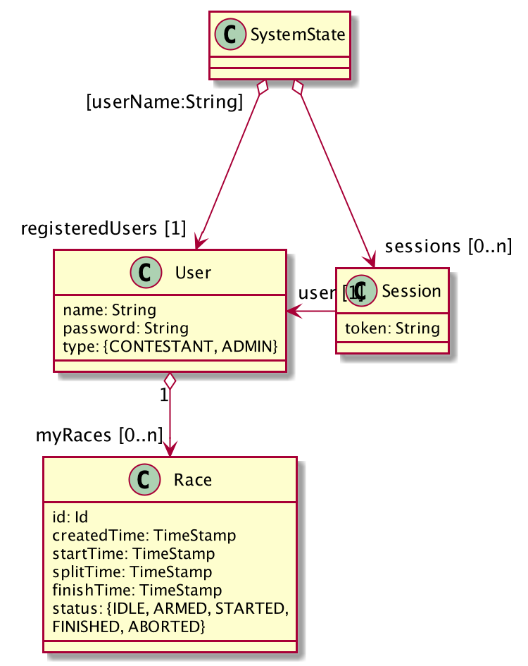

# System state transformations
## Domain model 
### Users and sessions

### Racing

## Business logic
The business logic of the system is described as actions and their post-conditions

* [Register contestant](#register-contestant)
* [User login](#user-login)
* [Signup for race](#signup-for-race)
* [Bail out from race](#bail-out-from-race)
* [Arm race](#arm-race)
* [Abort active race](#abort-active-race)
* [Start gate passage detected](#start-gate-passage-detected)
* [Split gate passage detected](#split-gate-passage-detected)
* [Finish gate passage detected](#finish-gate-passage-detected)

### Register contestant 
When a new contestant registers, user is added to the registered users.

**Signature**

`registerContestant(previousState: SystemState, name: String, password: String) => newState: SystemState`

**Post-condition**

If a user with the specified `name` already exists among the `previousState.registeredUsers`

* the system state is unchanged
* an error indicating that the user name is occupied has been emitted

otherwise     

* a new `User` has been with the specified `name` and scrambled `password` has been created and 
`newState.registeredUsers` contains this user and all users from `previousState.registeredUsers`
    

### User login
When a user authenticates, a session with a token is created and added to the sessions.

**Signature**

`userLogin(previousState: SystemState, name: String, password: String) => newState: SystemState`

**Post-condition**

If *no* user with the specified name is found among the `previousState.registeredUsers`

* the system state is unchanged
* an error indicated that the user name cannot be found has been emitted

otherwise, if the scrambled `password` does not match the password of the found user

* the system state is unchanged
* an error indicating that the user name cannot be found has been emitted

otherwise

* let `session` be a new `Session` in:
  - `newState.sessions` contains `session` and all sessions from `previousState.sessions`
    
###  Signup for race
When a contestant signs up for a race, a race is created and is placed into the queue.

**Signature**

`signupForRace(previousState: SystemState, token: String) => newState: SystemState`

**Post-condition**

[Session has been checked](#session-has-been-checked) 

If no session for the specified `token` is found among `previousState.sessions`

* the system state is unchanged
* an error indicating that no sessions exists has been emitted

otherwise, if a race for the user associated with the session, already exists in the queue

* the system state is unchanged
* an error indicating that the user is already present in the queue has been emitted

otherwise
* let `user` be the user associated with the found session and `newRace` be a new `Race` in:
    - `newRace` has been created and has been added to `user.myRaces` of the user associated with the session, 
       i.e. `newState.registeredUsers[user.name]` contains the new race
    - `newRace.status === IDLE`
    - `newState.queue` contains all races from `previousState.queue`
    - `newRace` is at the last position in `newState.queue`
    - `newState.queue` is sorted according to the order the races where added to the queue    

###  Bail out from race
When a contestant bails out from a previously sign up for a race, the race is removed from the queue and 
the race status is set to aborted. However, the race is kept among the races of the user.

**Signature**

`bailOutFromRace(previousState: SystemState, token: String) => newState: SystemState`

**Post-condition**

[Session has been checked](#session-has-been-checked) 

otherwise, if no race for the user associated with the session, exist in the queue

* the system state is unchanged
* an error indicating that the user does not exist in the queue has been emitted

otherwise

* let `race` be the race, found in the queue, for the user associated with the session, in:
  - `newState.queue` contains and all races from `previousState.queue`, except for `race`
  - `newState.queue` is sorted according to the order in which races where added    

### Arm race
When an administrator arm the ace, the race at head of the queue is moved to become the current active race and 
the status of that race is set to armed.

**Signature**

`armRace(previousState: SystemState) => newState: SystemState)`

**Post-condition**

[Session has been checked](#session-has-been-checked) 

If `previousState.queue` is empty

* the system state is unchanged
* an error indicating that the queue is empty has been emitted

If `previousState.currentRace` is **not** empty

* the system state is unchanged
* an error indicating that there already exists an ongoing race has been emitted

otherwise

* `newState.currentRace` is the head of `previousState.queue`
* `newState.currentRace.status === ARMED`
* `newState.queue` contains all races, except for the race for the head race, from `previousState.queue`
* `newState.queue` is sorted according to the order in which races where added    

### Abort active race
When the current active race is aborted, it is removed, regardless of its status, 
by unsetting the current active race and setting the status of the removed race to aborted.

**Signature**

`abortActiveRace(previousState: SystemState) => newState: SystemState`

**Post-condition**

[Session has been checked](#session-has-been-checked) 

If `previousState.currentRace` is not set

* the system state is unchanged
* an error indicating that there exists no ongoing race has been emitted

otherwise

* let `user` be the user associated with the session in:
  - `newState.currentRace` has no value
  - `newState.registeredUsers[user.name].myRaces[previousState.currentRace.id].status === ABORTED`    

### Start gate passage detected
When the start gate is passed during an active race, the time is registered (unless that gate has already been passed).

**Signature**

`passStartGate(previousState: SystemState, timeStamp: TimeStamp) => newState: SystemState`

**Post-condition**

If `previousState.currentRace` is not set

* the system state is unchanged

otherwise, if `previousState.currentRace.status !== ARMED`

* the system state is unchanged

otherwise

* `newState.currentRace.status === STARTED`
* `newState.currentRace.startTime === timeStamp`

### Split gate passage detected
When the split gate is passed during an active race, the time is registered (unless that gate has already been passed).

**Signature**

`passSplitGate(previousState: SystemState, timeStamp: TimeStamp) => newState: SystemState`

**Post-condition**

If `previousState.currentRace` is not set

* the system state is unchanged

otherwise, if `previousState.currentRace.status !== STARTED OR previousState.currentRace.splitTime !== undefined`

* the system state is unchanged

otherwise

* `newState.currentRace.startTime === timeStamp`

### Finish gate passage detected
When the finish gate is passed during an active race, the time is registered and the race is finished and
is moved from the current race to the leader board at the proper position.

**Signature**

`passSplitGate(previousState: SystemState, timeStamp: TimeStamp) => newState: SystemState`

**Post-condition**

If `previousState.currentRace` is not set

* the system state is unchanged

otherwise, if `previousState.currentRace.splitTime === undefined`

* the system state is unchanged

otherwise

* let `race` be `previousState.currentRace` with `status === FINISHED` and 
  `finishTime === timeStamp` in:
  - `newState.currentRace` is not set
  - `newState.leaderboard` contains `race` and all races from `previousState.leaderboard`
  - `newState.leaderboard` is sorted ascending according to `Race.finishTime` 

### Session has been checked 
If no session for the specified `token` is found among `previousState.sessions`

* the system state is unchanged
* an error indicating that no sessions exists has been emitted

otherwise

* return the found session
